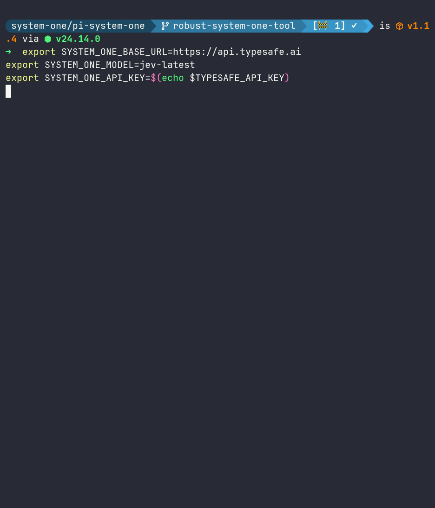

# pi-system-one

System One decisions for Pi. Plug in TypeSafe Jev, Reflex, or your own provider.

```bash
pi install npm:pi-system-one
```

   

---

Setup Provider:
##### locally hosted model e.g Reflex, von, laya etc, any model that supports `POST /v1/systemone`
```bash
export SYSTEM_ONE_BASE_URL=http://localhost:8008
```
or

##### typesafe/JEV
```bash
export SYSTEM_ONE_BASE_URL=https://api.typesafe.ai
export SYSTEM_ONE_MODEL=jev-latest
export SYSTEM_ONE_API_KEY=$(echo $TYPESAFE_API_KEY) # or directly paste the key
```


---

**Configuration**

The extension provides a `/so` command for configuring the System One client:

- `SYSTEM_ONE_BASE_URL` – required endpoint URL.
- `SYSTEM_ONE_MODEL` – optional default model name.
- `SYSTEM_ONE_API_KEY` – optional API key.

When you run `/so config`, you can:

- **Enter a new API key** – it is stored in memory only and will be lost when the session ends.
- **Enter `-`** – forget the memory‑only key. If an `SYSTEM_ONE_API_KEY` environment variable is present, the client will fall back to it; otherwise the key becomes absent.
- **Leave the input empty** – keep the existing value.

The current configuration can be inspected with `/so status`.

---

## `/judge`

The fastest way to use System One. A prompt shortcut that expands into
instructions calling the `system_one` tool explicitly, so routing
doesn't depend on inferring intent. For short, unstructured asks:

```
/judge should I ship this? <paste diff plus test summary>
```

```
/judge which team should take this ticket? <paste ticket>
```

---

## `system_one` skill

For everything else, the bundled skill teaches the agent when to call
`system_one`, which question type to use (`choice` / `noul` / `score`),
and how to read answers. It loads automatically — just ask for
quantified answers over material already in context. Probabilities and
confidence are the words that route to the tool. Retrieve facts first;
the judge weighs supplied state, it cannot recall facts.

See [SKILL.md](./skills/system-one/SKILL.md) for the full reference
and [use cases](./skills/system-one/references/use-cases.md) for
copy-pasteable recipes.

Examples — same decisions, quantified wording:

```
Pick one: fix forward with a minimal patch, or revert and re-land
later. Give me the probability of each and your confidence.
<paste context>
```

```
This just landed in our support queue — which team is the most likely
owner: billing, technical, or sales? Give me the probability for each
and your confidence for the pick. Also, how urgent is it on a low /
medium / critical scale? And should I escalate (yes/no probability,
no confidence needed)?
<paste ticket>
```

```
Should I ship this or revert it? Give me the probability that shipping
causes a follow-up bug within a week (yes/no probability only — noul
has no confidence field). Also rate the test coverage — none, partial,
or full — with probabilities and confidence for the pick.
<paste diff plus test summary>
```

Independent judgments over the same context should be batched into one
call, and answers should come back as calibrated, state-conditional
probabilities — with confidence for choice/score only (noul has no
confidence) — not prose guesses, and never as recalled facts.

Running your own backend? See the [system one core package](../system-one-core/README.md)
