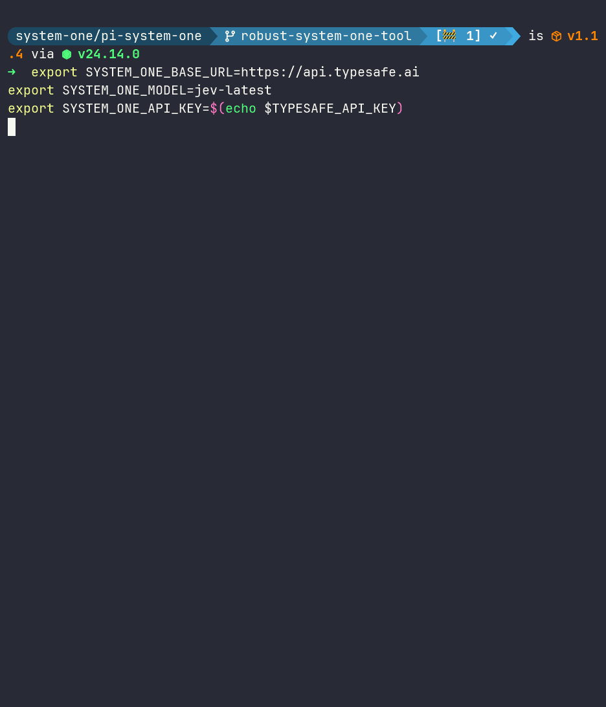

# pi-system-one

System One decisions for Pi. Plug in TypeSafe Jev, Reflex, or your own provider.

```bash
pi install npm:pi-system-one
```

## Pi built-in classifier vs `pi-system-one`

Pi already supports Jev through `codemode`. Use that path if you only need direct classifier calls and Pi-managed credentials. This extension adds a dedicated `system_one` tool, a `/judge` prompt, and a skill that guides when to use the tool.

| Need | Pi classifier through `codemode` | `pi-system-one` today |
|---|---|---|
| Setup | Enable `codemode`; sign in with `/login typesafe` or set `TYPESAFE_API_KEY`. | Install extension and sign in with `/login typesafe` or set `TYPESAFE_API_KEY`. Jev uses `jev-latest` by default. |
| Agent interface | Script calls `models.classify()`; you choose model, state, and questions. | Model calls `system_one` directly. `/judge` and bundled skill provide usage guidance. |
| Endpoints | Pi's registered classifier models, including Jev across supported providers. | Any backend compatible with `POST /v1/systemone`, including local Reflex and custom endpoints. |
| Inputs | Pi classifier schema: object state, string question fields, `bool` for yes/no. | Accepts string or JSON state, `noul` for yes/no, and normalizes common argument aliases. |
| Score output | Score and confidence. | Score, confidence, per-level probabilities, and legend when backend supplies them. |
| Credentials | Pi resolves provider credentials, including saved `/login typesafe` key. | TypeSafe endpoint reuses Pi credentials per call. Explicit `SYSTEM_ONE_API_KEY` or session key takes precedence; custom endpoints never receive Pi's TypeSafe key. |

For Jev-only use, Pi's built-in path needs no extension. Choose this extension when its direct tool, prompt guidance, custom endpoint support, or complete Score distribution matters. `/so config` can save non-secret settings or select Pi's native classifier. Native mode rejects Score questions because Pi does not expose their probability distribution. See [Pi classifier docs](https://github.com/earendil-works/pi/blob/main/packages/coding-agent/docs/models.md#use-classifier-models).

For Oh My Pi (OMP), install the published package with:

```bash
omp install npm:pi-system-one
```

For a local checkout, install or load the package directory directly:

```bash
omp install /path/to/pi-system-one
# or
omp --extension /path/to/pi-system-one
```

The `system_one` tool registers at startup. Without settings, it uses TypeSafe Jev through this extension's HTTP provider and asks Pi for your TypeSafe credential at call time. Run `/login typesafe` first, or set `TYPESAFE_API_KEY`.

<!--     -->

---


### Custom endpoint

For Reflex or another backend that supports `POST /v1/systemone`, run `/so config` and choose `custom`, or retain your existing environment setup:

```bash
export SYSTEM_ONE_BASE_URL=http://localhost:8008
export SYSTEM_ONE_MODEL=reflex
# Set SYSTEM_ONE_API_KEY only when your endpoint requires a key.
```

Existing `SYSTEM_ONE_BASE_URL` takes precedence over saved settings. For TypeSafe, `jev-latest` is supplied automatically when no model is set. Other endpoints may require `SYSTEM_ONE_MODEL`.


---

## Configuration

Run `/so config` to choose `typesafe` (default HTTP path), `custom` (any System One endpoint), or `native` (Pi classifier). `/so config native` and `/so config typesafe` switch directly. Non-secret settings are saved to `<agent-dir>/pi-system-one.json`, where `<agent-dir>` is Pi's agent directory (`~/.pi/agent` by default or `PI_CODING_AGENT_DIR`). Terminal Pi and Paseo must use the same agent directory to share that file and Pi's saved login. Restart or reload an already-running client after the other client changes settings. Use `/so status` to inspect current mode and credential availability.

For example, a saved custom endpoint looks like this:

```json
{
  "mode": "custom",
  "baseUrl": "http://localhost:8008",
  "model": "reflex",
  "timeoutMs": 10000
}
```

Never store a key in JSON. A key entered into `/so config` stays in this session only. Leave key input blank to keep it; enter `-` to forget it. For custom endpoints, set `SYSTEM_ONE_BASE_URL` with `SYSTEM_ONE_API_KEY` if using environment credentials. An environment key without an environment endpoint never follows a saved custom URL. Custom URLs saved by `/so config` must be HTTP(S), without URL credentials, query, or fragment; put authentication in the key input or environment instead. Native mode supports Choice and Noul but rejects Score questions rather than hide missing probabilities. For full Score results, select `typesafe` or `custom`.

Environment endpoint and model values override saved settings at startup. A saved model is not reused when an environment endpoint points elsewhere. An explicit `/so config` choice takes effect immediately in this session. If both are set, the environment endpoint wins again on next startup.

---

## `/judge`

The fastest way to use System One. A prompt shortcut that expands into
instructions calling the `system_one` tool explicitly, so routing
doesn't depend on inferring intent. For short, unstructured asks:

```
/judge should I ship this? <paste diff plus test summary>
```

```
/judge which team should take this ticket? <paste ticket>
```

---

## `system_one` skill

For everything else, the bundled skill teaches the agent when to call
`system_one`, which question type to use (`choice` / `noul` / `score`),
and how to read answers. It loads automatically — just ask for
quantified answers over material already in context. Probabilities and
confidence are the words that route to the tool. Retrieve facts first;
the judge weighs supplied state, it cannot recall facts.

See [SKILL.md](./skills/system-one/SKILL.md) for the full reference
and [use cases](./skills/system-one/references/use-cases.md) for
copy-pasteable recipes.

Examples — same decisions, quantified wording:

```
Pick one: fix forward with a minimal patch, or revert and re-land
later. Give me the probability of each and your confidence.
<paste context>
```

```
This just landed in our support queue — which team is the most likely
owner: billing, technical, or sales? Give me the probability for each
and your confidence for the pick. Also, how urgent is it on a low /
medium / critical scale? And should I escalate (yes/no probability,
no confidence needed)?
<paste ticket>
```

```
Should I ship this or revert it? Give me the probability that shipping
causes a follow-up bug within a week (yes/no probability only — noul
has no confidence field). Also rate the test coverage — none, partial,
or full — with probabilities and confidence for the pick.
<paste diff plus test summary>
```

Independent judgments over the same context should be batched into one
call, and answers should come back as calibrated, state-conditional
probabilities — with confidence for choice/score only (noul has no
confidence) — not prose guesses, and never as recalled facts.

Running your own backend? See the [system one core package](../system-one-core/README.md)
